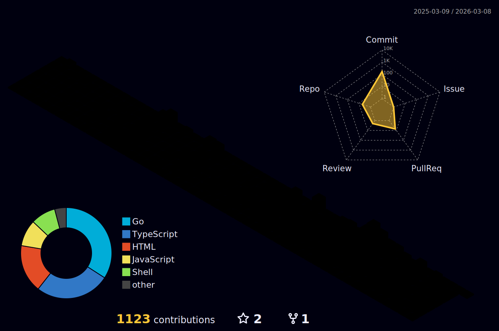

<div id="badges" align="center">
  <a href="https://www.linkedin.com/in/manjul-tamrakar/">
    
  </a>
  <a href="https://www.instagram.com/manjul.tamrakar/">
    
  </a>

  <a href="https://twitter.com/tamrakar999">
    
  </a>

[](https://wakatime.com/@f337b176-5837-4884-bc66-626771d2ae76)
  
</div>

---

### :man_technologist: About Me :

  - 👋 Hi, I’m @Tamrakar182.
  - 👀 I’m interested in computers.
  - 🌱 I’m currently learning Android Development with Jetpack Compose.
  - 💞️ I’m looking to collaborate on open source projects.
  - 📫 How to reach me: manjultamrakar4@gmail.com
  
---

### :hammer_and_wrench: Languages and Tools :

<details>
  <summary><b>🔨 &nbsp;Tools I use</b></summary>
  <br/>
      

</details>

<details>
  <summary><b>:computer: &nbsp;Main tech knowledge</b></summary>
  <br/>
  
</details>

---

### :fire: My Stats :


<details>
  <summary><b>:gear: &nbsp;GitHub Statistics</b></summary>
  <br/>
    <p align="center">
        
    </p>
    <p align="center">
         
    </p>
  
	

</details>

<details>
	<summary><b>🔬 &nbsp;More Detailed Statistics</b></summary>
	<br/>
	
<!--START_SECTION:waka-->

```txt
From: 14 July 2023 - To: 02 January 2026

Total Time: 2,064 hrs 55 mins

TypeScript             1,233 hrs 58 mins>>>>>>>>>>>>>>>----------   59.76 %
Kotlin                 488 hrs 9 mins  >>>>>>-------------------   23.64 %
JavaScript             71 hrs 49 mins  >------------------------   03.48 %
JSON                   53 hrs 49 mins  >------------------------   02.61 %
Other                  23 hrs 13 mins  -------------------------   01.12 %
```

<!--END_SECTION:waka-->


</details>

---
  
<!---
Tamrakar182/Tamrakar182 is a ✨ special ✨ repository because its `README.md` (this file) appears on your GitHub profile.
You can click the Preview link to take a look at your changes.
--->
