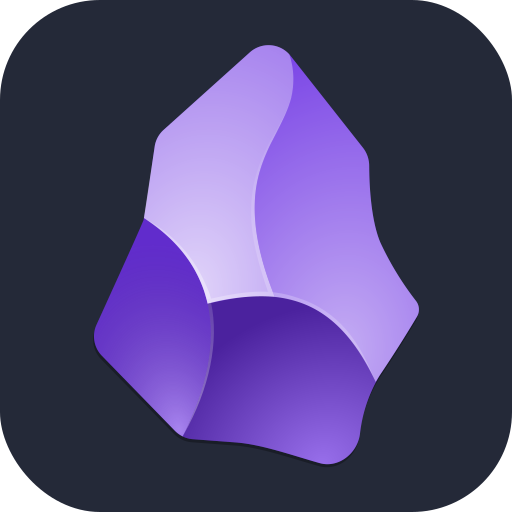

<div id="badges" align="center">
  <a href="https://www.linkedin.com/in/manjul-tamrakar/">
    
  </a>
  <a href="https://www.instagram.com/manjul.tamrakar/">
    
  </a>

  <a href="https://twitter.com/tamrakar999">
    
  </a>
</div>

---

### :man_technologist: About Me :

  - 👋 Hi, I’m @Tamrakar182
  - 👀 I’m interested in Everything basically
  - 🌱 I’m currently learning React, TypeScript and GraphQL.
  - 💞️ I’m looking to collaborate on open source projects.
  - 📫 How to reach me: manjultamrakar4@gmail.com
  
---

### :hammer_and_wrench: Languages and Tools :

<details>
  <summary><b>🔨 &nbsp;Tools I use</b></summary>
  <br/>
       &nbsp

</details>

<details>
  <summary><b>:computer: &nbsp;Main tech knowledge</b></summary>
  <br/>
      
</details>

---

### :fire: My Stats :


<details>
  <summary><b>:gear: &nbsp;GitHub Statistics</b></summary>
  <br/>
    <p align="center">
        
    </p>
    <p align="center">
         
    </p>
  
	

</details>

<details>
	<summary><b>🔬 &nbsp;More Detailed Statistics</b></summary>
	<br/>
	<!--START_SECTION:waka-->

```txt
From: 14 July 2023 - To: 12 August 2023

Total Time: 92 hrs 49 mins

TypeScript   78 hrs 57 mins  >>>>>>>>>>>>>>>>>>>>>----   85.07 %
Other        6 hrs 30 mins   >>-----------------------   07.01 %
Python       4 hrs 22 mins   >------------------------   04.72 %
Markdown     1 hr 9 mins     -------------------------   01.24 %
C            33 mins         -------------------------   00.61 %
Git          19 mins         -------------------------   00.35 %
CSS          14 mins         -------------------------   00.26 %
JSON         11 mins         -------------------------   00.20 %
HTML         11 mins         -------------------------   00.20 %
JavaScript   9 mins          -------------------------   00.17 %
```

<!--END_SECTION:waka-->
</details>

---
  
<!---
Tamrakar182/Tamrakar182 is a ✨ special ✨ repository because its `README.md` (this file) appears on your GitHub profile.
You can click the Preview link to take a look at your changes.
--->
